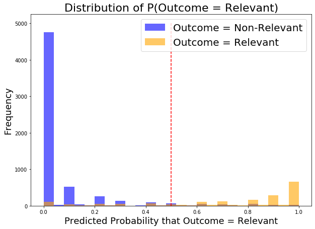

# ALERT.LY
**Brianna Lytle, De'Varus May, Sibel Tanoglu**
**DSI-CC9_LA**

# Problem
We were given the task to design and implement a web-tool for a rapid alert and notification system about a natural disaster - in close to real time. The tool created would alert about any natural disaster immediately after it happens. 

Traditional methods on going about creating an alert system rely on specific information that comes from official sources such as the USGS. This tool that our group aims to build must utilize social media activity to identify such natural disasters and will alert a user when the event first occurs.

When this project was assigned, there were several wildfires spreading acorss California that were affecting millions of people and their homes. Due to this, we felt it was important to focus on California wildfires.

# Data
Our group used several different methods to scrape tweets. To scrape from Twitter, we used the Tweepy Library. However, this API only let us scrape tweets within the last 7 days. Through research we also found that there is a python library called GetOldTweets3 that allows us to scrape tweets older than 7 days. 

## Scrapes from Tweepy:
We were able to scrape most of our targeted data from Tweepy due to the timing of this project. There were about 5 significant fires that were occuring across California while working on this project. We filtered the scrape of these tweets by searchign for a specific term (e.g. "maria fire"), specific coordinates, and the range of miles outside those coordinates.

### API Instructions:

It requires to create a Twitter developer account and create an app to obtain consumer keys and access tokens.
For further information: https://developer.twitter.com/en.html

Please follow the instructions on Twitter_Data_Collection notebook in this repository to generate a json file with a blank dictionary to input relevant information. Find twitter_cred.json file and type consumer key, consumer secret, access key, access secret.

## Scrapes from GetOldTweets3
We used this library to scrape tweets before the current fire season. The purpose of these tweets were to (1) add to our Non-related emergency tweet class and (2) add to the language that would be used when fires are not occuring in California. This is useful for our model to identify the language, terms, and sentiment used when classifying whether a tweet is fire-emergency related or not.

After scraping from the GetOldTweets3 library, we feel that there is some sort of archive. When we scraped tweets from a specific time period, only a fraction of tweets we expected were returned.

**Total Data Amount**
Our final dataset consisted of 24,410 tweets. The related/targeted tweets consisted of 5,691 tweets (23.3% of data), and the unrelated tweets consisted of 18,719 tweets (76.6% of data).

All data that was used for our model is in the data folder.

# Baseline Model
After basic EDA, we ran a baseline model using CountVectorizer and Logistic Regression. Our baseline model only contained about 10,000 tweets where ~50% were emergency-related and ~50% were non-emergency related. We used a list custom stop word list that we created during our basic EDA. After this basic model, our training accuracy score was 0.8355 and our testing score was 0.8205. 

# Exploratory Data Analysis
## Features in Text
Feature columns that were addded to the dataframe were:
- Word count of tweet
- Character count of tweet
- If a tweet contained a mention (e.g. "@username")
- Count for how many times a mention was used in a tweet
- If a tweet contained "https" representing a link that was used in the tweet
- If California Gavin Newsom (@GavinNewsom) was mentioned in a tweet
- If Los Angeles Mayor Eric Garcetti (@MayorOfLA) was mentioned in a tweet
- If California Senator Kamala Harris (@KamalaHarris) was mentioned in a tweet
- If @CAL_FIRE was mentioned in a tweet

## Structure of Tweets
The word count of the targeted tweets had an IQR between 13 to 21 words with a max of about 32 words. On the other hand, the IQR of unrelated tweets was between 5 to 17 words with a much larger spread. This shows us that the fire-related tweets were more to the point and didn't have much variation. We can see the same pattern of word count in the character count boxplot comparison as well.

In most targeted tweets, there were at least one mention. This graph shows us that is was more common for targeted tweets to contain a mention than non-related emergency tweets. In addition, there is more of a spread for mentions in non-related emergency tweets

## Common N-grams Used
After removing necessary stop words, we did performed an n-gram analysis to examine common single word terms and up to quad-gram terms. For our emergency-related tweets, the common terms used related to weather patterns, warnings (e.g. "red flag", "evacuation") and people related activities (ex. freeways, work, etc.). A lot of our data was pulled from the fires around greater Los Angeles area. This made a difference on our n-gram investigation because we ran across terms associated with the "405", "santa ana winds", and news stories that were associated with Los Angeles fires (see other Notes)

## Sentiment Analysis
This chart of overall sentiment analysis shows that the spread of fire related tweets is more negative compared to the spread of non-emergency tweets. Less than half of the fire related tweets compouted a positive sentiment score.

## Other Notes
In Los Angeles, many celebries were affected by the fires that were occuring. Lebron James made a big impact on our model because him and his family had to evacuate from his home and spent the night seeking shelter. John Cena also donated $500,000 to the efforts of supportiing the firefighters out in the field. Both athletes made an impact because other twitter accounts such as LA Times and Barstool sports picked up this information creating their actions as a trending topic. Because of this we had to add them and their accoutns to our stop words. In the future, when we continue to scrape and add data to our model, this kind of issue shouldn't be a problem and we may be able to use a spike of a celebrity name during a disaster as a feature. 

# Model / Model Evaluation
Our group agreed that we shoudl perform several gridsearches to ensure we get the best model possible. We also knew that it would be best to use TF-idf as the model transformer. We decided to use transformer because it would examine all of the words in a document and determine it's importance relative to other documents. 

Model estimators we tested in our gridsearches include: 
- Logistic Regression
- RandomForest Classifier
- Bagging Classifier
- KNearest Neighbors
- XGBoost

In all our gridsearches, we (1) ran our search with only the text data and (2) ran our search with the text data and the sentiment scores (positive, negative, compound, neutral) that were explored during the EDA process. Below is are the results of the scores from all the final models we ran.

Model | Train Score | Test Score | Misclassification | Sensitivity | Specificity | Precision |
-------|-------------| --------|-------| ------| ------|----------|
Tf-idf / Logistic Regression |.924972 |.912363| .08764 |.9208 | .87709 | .9691 |
Tf-idf / Logsitic Regression Union |.929436|.916335 | .83664 | .9257 | .87814 | .96859 |
Tf-idf / Random Forest |.984346|.92217 | .077802 | .933743 | .8728 | .86557 |
Tf-idf / Random Forest Union |.990461| .91559 | .08441 | .92739 | .8351 | .86884 |
Tf-idf / Bagging Classifier | .766846 | .766881 | .233119 | .76688 | 0 | 100% |
Tf-idf / Bagging Classifier Union | . 98881 | .903798 | .0963 | .92806 | .8146 | .94804 |
Tf-idf / KNN | .927602 |.878351 | .121649 | .888839 | .82726 | .96164 |
Tf-idf / KNN Union | .878928 | .840243 | .159757 | .83541 | .88627 | .98591 |
Tf-idf / XG Boost | .96056 | .919687 | .08531 | .93177 | .8728 | .966 |
Tf-idf / XG Boost Union | .89758 | .88952 | .11846 | .9017 | .8351 | .96067 |

Based on the best estimator test ran (using text data vs. using text data and sentiment score), we chose the best test and plotted it's ROC AUC graph in order to visualize what model would be best for our web-application.

Random Forest and XGBoost performed best with with only text data. Logistic Regression, Bagging Classifier, and KNearest Neighbors performed best using sentiment scores and text data.

## Final Model
We decided our final model with be from the **Tf-idf & RandomForest Gridsearch** we ran that only uses text data. This model had the strongest sensitivity score (true positive rate) and one of the strongest specificity score(true negative rate). The sensitvity score ensures that all tweets that all tweets that we classify as an emergency actually resembles and emergency. A strong true negative rate ensures that all tweets we classify as non-emergency is actually non related to a fire-emergency. This is the best case scenario for us because we want to ensure users get the notification they need, as well as any situation of "yelling fire in a movie theatre" that could cause uncessary chaos

### Option to change thresholds - focus on Sensitivity of model
We wanted to hone in on the sensitivity of our model. This is important to us because we want to ensure we classify all non-emergency tweets as accurately as possible. It was important for us that our web application didn't cause uneccesarry stress and chaos to users. Below is an example of our distribution and the movement of thresholds. By moving the threshold from 0.5 to 0.25, we increased the sensitvity score from 0.8728 to 0.907. _Note: this did slightly decrease our specificy score of our model. We can adjust this threshold to the needs of the client._

# Flask App

Our major goal is to create a highly sensitive and robust fire alert system. We focused on minimizing false negatives of our best model so that our system would be reliable by identifying all possible emergencies without missing a single one. 

## ALERT.LY 1.0

We created a tool to test our model’s accuracy more efficiently. Alertly 1.0 is a responsive web application utilizes TFIDF vectorizer and Random Forest model, Flask framework and it is hosted by PythonAnywhere platform. It takes a tweet text as input and displays the outcome of language processing classification.

Please check the live demo video in media folder in this repository.

## ALERT.LY 2.0

We used the moving average of our time series data to capture short-term (hourly) fluctuations. We simply calculated the difference between hourly related tweets and past 2 hours average. We created a secondary application which iterates through the time series data and displays alert when there is a significant increase in number of relevant tweets. It evaluates the trend based on a selected threshold value. As soon as it captures a spike, it pops up the alert by turning the twitter logo to red color and shows the time of the emergency.

Please check the live demo video Alertly 2.0 in media folder in this repository.

Once we found a model that we could successfully classify whether or not a tweet is relevant to an emergency, we needed a way to determine if we needed to alert our audience or not. This brought us to taking our newly predicted DataFrame of tweets and perform some time series analysis on it. We grouped our data by hour and took an average of total tweets & total relevant tweets by hour. We took those averages and calculated the difference between the number of relevant tweets in that hour compared to the previous hour. If there is a significant increase of relevant tweets in the current hour, we will alert our users of a significant emergency so that they can take action. Since we only have approximately 2 weeks of data in light of the recent fires we manually determined the spikes in activity, but ideally with enough data would like to created another model to classify this activity for us.

# Conclusion / Next Steps
**In our time frame we achieved our goal and were able to work on stretch goals.**

We were able to create a model that could classify tweets on wheather a tweet is fire related or not. We plan to further improve our model and the next steps by:
- Gathering more data
- more investigation of different features that could be used in our model
- implementing/investigating data from other natural disasters in order to make the application more diverse
- Futher improve/optimzie Type II Errors
- Create a model to detect anomalies of emergency related tweets
- Integrate live streamming Twitter API with Alert.ly web app for real time alerts
- Final Mobile Application from ALERT.LY

